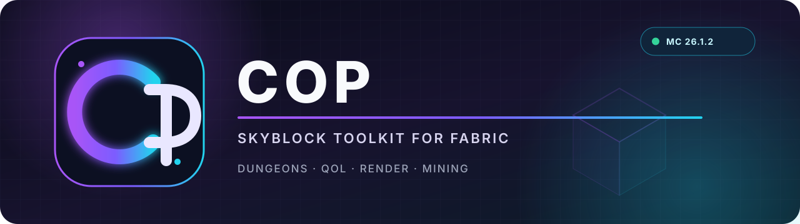

<div align="center">



# COP

<p><strong>Ein fokussiertes Hypixel-SkyBlock-Toolkit für Fabric:</strong><br>
Dungeons, QoL, Rendering, Mining und anpassbare HUDs in einer Client-Mod.</p>

[](https://github.com/elv1n200/COP/actions/workflows/build.yml?query=branch%3Amc26)
[](#voraussetzungen)
[](#voraussetzungen)
[](https://fabricmc.net/)
[](LICENSE)
[](docs/client-test-checklist.md)

[Download](https://github.com/elv1n200/COP/releases/latest) · [Installation](#installation) · [Features](#features) · [Commands](#commands) · [Dokumentation](docs/README.md) · [Support](SUPPORT.md)

</div>

> [!IMPORTANT]
> Der Branch **`mc26`** zielt ausschließlich auf **Minecraft 26.1.2**. Die automatisierten Checks ersetzen keinen In-Game-Test: Vor einer Veröffentlichung muss die [Client-Test-Checkliste](docs/client-test-checklist.md) vollständig durchlaufen werden. Ältere 1.21.x-Builds werden auf diesem Branch nicht weitergeführt.

> [!CAUTION]
> Einige Module automatisieren Eingaben oder Spielabläufe. Das kann gegen Regeln eines Servers verstoßen und zu Sanktionen führen. Prüfe die aktuellen Regeln selbst und aktiviere nur Funktionen, deren Wirkung du verstanden hast. COP ist weder von Mojang noch von Hypixel entwickelt oder bestätigt.

## Warum COP?

COP bündelt viele SkyBlock-Werkzeuge in einer gemeinsamen, durchsuchbaren ClickGUI. Module lassen sich einzeln aktivieren, konfigurieren und mit Keybinds versehen; HUD-Elemente können direkt im Editor angeordnet werden. Der mc26-Branch portiert diese Oberfläche auf das nicht obfuskierte Minecraft 26.1.2 und Java 25.

| Bereich | Auswahl vorhandener Funktionen |
|---|---|
| **Dungeons** | Dungeon Map/ESP, Secret Routes, Solver/HUDs sowie getrennte QoL- und Boss-Automation für Terms, Leap, I4, Türen, Masken/Phoenix, Cloak, Debuffs und Requeue |
| **Auto Croesus** | Chest-Vergleich, Preis-/Profit-Overlay, optionale Kismet-Logik, Always-Buy-/Worthless-Listen und lokales Loot-Log |
| **Render & HUD** | Player ESP, Name Tags, Etherwarp Overlay, Custom Mage Beam, Arrow Hitboxes, Game Tint, Render Optimiser und HUD-Editor |
| **QoL & Chat** | Item Protection, Inventory-Suche, Hotbar-/Loadout-/Wardrobe-Presets, Chat-Suche/-Ersetzungen und temporäre Koordinaten-Waypoints |
| **Aktivitäten** | Blaze-Slayer- und Dojo-Helfer, Carnival, Chocolate Factory, Auto Sell, Party-Regeln und Escrow-Retries |
| **Player & Mining** | No Rotate/optionale Zero-Ping-Camera, defensiver Movement-Blink, Crystal Hollows Map/Scanner, Commission Display, Mining Alert und No Break Reset |
| **Integrationen** | Windows-Spotify-HUD ohne Spotify-Login, kontrollierter GitHub-Updater und eine kleine [Addon-API](docs/addons.md) |

Die Liste ist bewusst eine Übersicht und keine Aussage, dass jedes Modul bereits auf mc26 im Live-Client abgenommen wurde. Die vorgesehene Client-Prüfung steht in der [Client-Test-Checkliste](docs/client-test-checklist.md).

## Installation

### Voraussetzungen

- **Minecraft 26.1.2**
- **Java 25** für Minecraft und lokale Builds
- **Fabric Loader 0.19.2** (getesteter Mindeststand)
- **Fabric API 0.149.0+26.1.2** (getesteter Mindeststand)
- **Fabric Language Kotlin 1.13.9+kotlin.2.3.10** (getesteter Mindeststand)

### Release installieren

1. Erstelle ein separates Minecraft-26.1.2-Profil und installiere den [Fabric Loader](https://fabricmc.net/use/installer/).
2. Lege die zu 26.1.2 passenden JARs von [Fabric API](https://modrinth.com/mod/fabric-api) und [Fabric Language Kotlin](https://modrinth.com/mod/fabric-language-kotlin) in den `mods/`-Ordner.
3. Lade unter [Releases](https://github.com/elv1n200/COP/releases/latest) ausschließlich das Asset `cop-<version>+mc26.1.2.jar` herunter. Die `-sources.jar` ist **nicht** spielbar.
4. Lege die COP-JAR ebenfalls in `mods/` und starte das Profil mit Java 25.
5. Öffne COP mit **Right Shift** oder `/cop` und beginne mit deaktivierten Modulen.

Wenn ein Release kein exakt zu `mc26.1.2` passendes Asset enthält, verwende es nicht. Baue in diesem Fall den aktuellen `mc26`-Stand selbst oder warte auf ein passendes Release.

## Features

<details open>
<summary><strong>Dungeon-Navigation, Solver und HUDs</strong></summary>

Die Dungeon-Werkzeuge reichen von Map, ESP und Secret Routes über Puzzle-Solver
bis zu Splits, Secrets, Tick Timers, Door Keys, Room Alerts sowie lokalen Score-,
Blessing- und Warp-Cooldown-Anzeigen. Terminal-Waypoints können sich auf den
aktuellen Goldor-Abschnitt beschränken und blenden ein Terminal nur bei einem
exakt bestätigten Serverstatus aus. Die ClickGUI gruppiert alles nach World
Render, HUDs, Solvern, QoL und stärkerer Automation.

</details>

<details>
<summary><strong>Dungeon-QoL und Boss-Automation</strong></summary>

Die ClickGUI trennt harmlose Run-Helfer von stärkerer Automation. Zur QoL-Gruppe
gehören unter anderem Dungeon Potion, Architect's Draft und Requeue. Unter
**Cheats & Automation** liegen Auto Terms, Auto I4, Class Abilities, Door Opener,
Invincibility-Kette, Wither Cloak, Barrier Boom, Debuff Helper und die erweiterten
Leap-/Breaker-/M3-Optionen. Alle Module sind einzeln opt-in; mehrtickige Aktionen
koordinieren Hotbar, Inventar, Rotation, Bewegung und Interaktion, damit sie sich
nicht gegenseitig übernehmen.

</details>

<details>
<summary><strong>Presets, Economy, Slayer und Dojo</strong></summary>

Benannte Hotbar-Presets sowie Loadout- und Wardrobe-Keybinds ergänzen die
allgemeine Automation. Economy-Funktionen sind in einer eigenen Unterkategorie
gebündelt; Auto Sell arbeitet ausschließlich mit einer lokalen Allowlist und
zusätzlichen Item-Schutzregeln. Blaze Slayer und die Dojo-Tests besitzen jeweils
eigene, einklappbare Bereiche statt als ungeordnete Einzelmodule aufzutauchen.

</details>

<details>
<summary><strong>Auto Croesus</strong></summary>

Auto Croesus vergleicht Chest-Kosten mit Bazaar-/Lowest-BIN-Daten, kann Kismet-Rerolls einbeziehen und führt ein lokales JSONL-Loot-Log. Die Entscheidung lässt sich über Always-Buy- und Worthless-Listen beeinflussen. Details, Grenzen und Dateiformate stehen in der [Auto-Croesus-Dokumentation](docs/auto-croesus.md).

</details>

<details>
<summary><strong>Render, Player und Mining</strong></summary>

Anpassbare Overlays und HUDs ergänzen Player-, Etherwarp- und Dungeon-Informationen. Für Crystal Hollows stehen Map und Scanner bereit; Player-Werkzeuge umfassen unter anderem Auto Sprint, Snap Tap, Lag Detector, Etherwarp Helper und Fishing Helper.

</details>

<details>
<summary><strong>Chat, Inventar und Integrationen</strong></summary>

COP erweitert Chat und Inventar um Suche, visuelle Ersetzungen, temporäre
x/y/z-Waypoints und einen lokalen Schutz vor versehentlichem Drop, Verkauf oder
Salvage wichtiger Items. Das Spotify-HUD liest unter Windows die lokale Media
Session und benötigt keinen Spotify-Login. Der optionale Auto Updater prüft
GitHub Releases; **Auto Download ist standardmäßig aus** und ein Asset wird nur
mit passender Minecraft-Version und gültigem SHA-256-Digest akzeptiert.

</details>

## Commands

| Command | Funktion |
|---|---|
| `/cop` oder `/cope` | Öffnet die ClickGUI |
| `/cop toggle <module>` | Schaltet ein Modul um |
| `/cop hud` | Öffnet den HUD-Editor |
| `/cop diagnostics` | Kopiert einen datensparsamen Support-Report in die Zwischenablage |
| `/cop hotbar save\|load\|delete\|list …` | Verwaltet benannte Hotbar-Presets und optionale exakte Chat-Trigger |
| `/cop loadout <1-12>` / `/cop wardrobe <1-9>` | Rüstet den gewählten Loadout- bzw. Wardrobe-Slot aus |
| `/cop autosell …` | Verwaltet die lokale Auto-Sell-Allowlist |
| `/cop autokick …` | Verwaltet die explizite Namensliste für Party Auto Kick |
| `/cop protect [toggle\|id\|list\|clear]` | Schützt das gehaltene Item exakt oder als SkyBlock-Itemtyp und verwaltet die lokale Schutzliste |
| `/cop loot [today\|week\|all\|reset]` | Zeigt oder löscht die lokale Auto-Croesus-Zusammenfassung |
| `/cop alwaysbuy [list\|add\|remove\|clear] [ID]` | Verwaltet die Always-Buy-Liste |
| `/cop worthless [list\|add\|remove\|clear] [ID]` | Verwaltet die Worthless-Liste |
| `/cop findlobby <area> <day\|server\|player> <value>` | Sucht eine passende Lobby |
| `/cop antiafk <delay>` | Startet den kamerabewegungsabhängigen Anti-AFK-Helfer |
| `/clearchat` | Leert den sichtbaren COP-/Minecraft-Chat |
| `/f0` … `/f7`, `/m1` … `/m7` | Joint die gewählte Catacombs-Instanz |
| `/copdev …` | Entwicklerwerkzeuge; nicht für den normalen Spielbetrieb gedacht |

`/cop diagnostics` enthält Laufzeit-, Fenster-, Mod- und aktivierte COP-Modul-Daten, aber **keinen Spielernamen, keine Serveradresse, keine Tokens, keine einzelnen Einstellungswerte und keine Dateipfade**. Prüfe den Text trotzdem vor dem Veröffentlichen. Mehr dazu in [Support](SUPPORT.md).

## Daten, Netzwerk und Recovery

- Konfigurationen und optionale Feature-Daten liegen lokal unter `<Minecraft-Profil>/config/cop/`.
- Kann eine JSON-Konfiguration nicht gelesen werden, startet COP mit Defaults und bewahrt bis zu drei unterschiedliche, höchstens 16 MiB große Fassungen als `*.corrupt-<hash>.bak` auf.
- Preisfunktionen fragen die öffentlichen Hypixel- und Coflnet-Endpunkte ab. Der Updater kontaktiert GitHub nur, wenn das Modul aktiv ist; sein automatischer Download ist opt-in.
- Das Auto-Croesus-Loot-Log ist lokal und kann mit `/cop loot reset` gelöscht werden.

Details zu Meldungen, Datenschutz und sicherer Weitergabe von Logs: [SUPPORT.md](SUPPORT.md) und [SECURITY.md](SECURITY.md).

## Aus dem Source bauen

Der `mc26`-Branch nutzt [Stonecutter](https://github.com/kikugie/stonecutter), Loom 1.16 und eine JDK-25-Toolchain. Nach dem Checkout:

```bash
./gradlew :26.1.2:test
./gradlew :26.1.2:build
```

Unter Windows:

```powershell
.\gradlew.bat :26.1.2:test
.\gradlew.bat :26.1.2:build
```

Die spielbare JAR landet in `versions/26.1.2/build/libs/`. `./gradlew buildAll` sammelt Produktions-JARs zusätzlich unter `dist/`. Für einen Entwicklungsstart mit DevAuth steht `./gradlew runClient` bereit.

> [!NOTE]
> Ein erfolgreicher Gradle-Build bestätigt Kompilierung und automatisierte Tests, nicht die korrekte Reaktion auf Live-Hypixel-Pakete, GUIs oder Servertexte. Dafür ist der [manuelle Client-Test](docs/client-test-checklist.md) verpflichtend.

## Mitmachen und Support

- Fehler reproduzierbar melden: [SUPPORT.md](SUPPORT.md) und [Bug Report](https://github.com/elv1n200/COP/issues/new?template=bug_report.yml)
- Änderungen vorbereiten: [CONTRIBUTING.md](CONTRIBUTING.md)
- Neue Funktion vorschlagen: [Feature Request](https://github.com/elv1n200/COP/issues/new?template=feature_request.yml)
- Sicherheitsproblem vertraulich melden: [SECURITY.md](SECURITY.md)
- Versionen und Änderungen: [CHANGELOG.md](CHANGELOG.md)

## Credits und Lizenz

COP enthält Ports und Konzepte aus mehreren Projekten. Herkunft, die klare
Trennung zwischen Port und Verhaltensreferenz sowie die zugehörigen Lizenzen
sind in [CREDITS.md](CREDITS.md),
[THIRD_PARTY_NOTICES.md](THIRD_PARTY_NOTICES.md) und [LICENSES/](LICENSES/)
dokumentiert.

Der eigene COP-Code steht unter der [GNU GPL 3.0 only](LICENSE).
